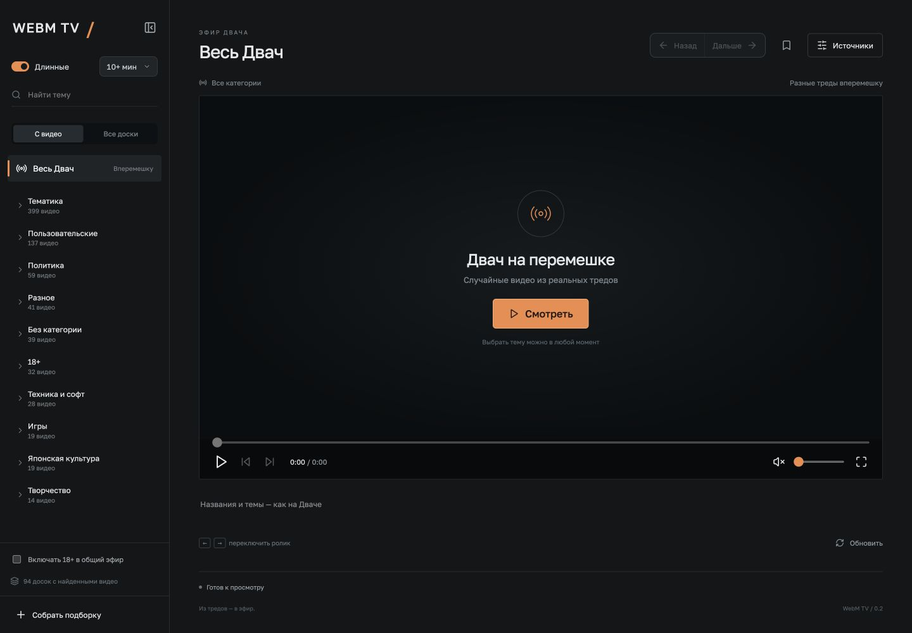
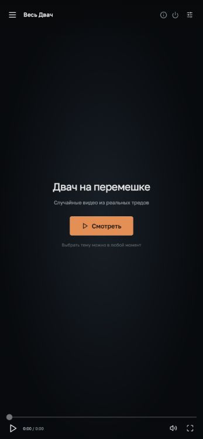
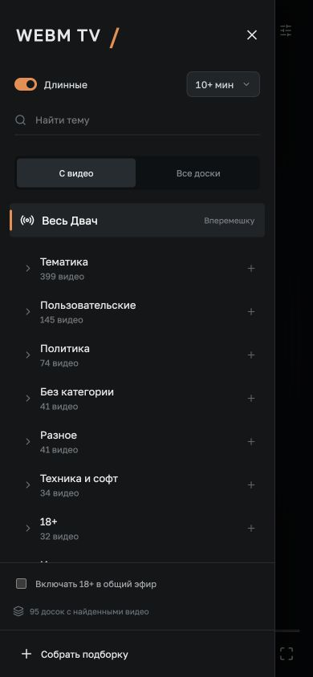

# WebM TV — случайные видео из Двача

[Смотреть онлайн](https://webmtv.b020207d.sslip.io) · [English](README.en.md) · [Релизы](https://github.com/rshagiev/webm-tv/releases) · [Запустить у себя](#запустить-у-себя) · [Смотреть на телефоне](#смотреть-на-телефоне)

Свой видеоэфир из тредов и ответов Двача: выбираешь весь сайт, доску или конкретный тред и листаешь WebM/MP4. На компьютере — кнопки и клавиатура, на телефоне — свайпы.



Онлайн-версия — бесплатный тестовый запуск. Установка не нужна; персональные настройки хранятся в браузере. [Устройство сервера и ограничения](docs/hosting.md).

## Запустить у себя

Нужен **[Node.js LTS](https://nodejs.org/), версии 22.12 или новее**. npm входит в установку Node.js.

1. [Скачайте ZIP](https://github.com/rshagiev/webm-tv/releases/latest/download/webm-tv.zip) и распакуйте.
2. На **macOS** дважды нажмите **WebM TV.app**. На **Windows** — **Start.vbs** или **Start.cmd**.
3. Дождитесь открытия браузера. Готово — терминал держать открытым не нужно.

Первый запуск сам установит зависимости и соберёт интерфейс; это может занять несколько минут. Повторный клик откроет уже работающий WebM TV. Не перемещайте файл запуска отдельно от папки проекта. Для установки и просмотра нужен интернет.

Если macOS блокирует скачанное приложение или вы используете Linux, откройте терминал в папке проекта и выполните:

```sh
npm start
```

При таком запуске откройте **http://localhost:4173** и держите терминал открытым. Остановить сервер можно кнопкой питания в интерфейсе или `Ctrl+C`.

<details>
<summary>Через Git</summary>

```sh
git clone https://github.com/rshagiev/webm-tv.git
cd webm-tv
npm start
```

</details>

## Выключение и адреса

Кнопка **ⓘ** вверху показывает адрес для этого компьютера и адреса для телефона в локальной сети. Адрес можно скопировать; через обычный HTTP браузер может потребовать выделить его вручную.

Кнопка **питания** останавливает сервер WebM TV и просмотр на всех подключённых устройствах. Для нового запуска снова откройте **WebM TV.app** / **Start.vbs**. Закрытие вкладки само по себе сервер не выключает. Журнал запуска находится в `data/desktop.log`.

## Смотреть на телефоне

Мобильный интерфейс занимает весь экран: свайп вверх переключает на следующий ролик, вниз возвращает предыдущий. Нажмите на видео для паузы, на меню слева сверху — чтобы выбрать доску, тред или подборку. Можно листать общий эфир, а затем остаться в понравившемся треде.

<p>
  
  
</p>

*Стартовый экран и выбор каналов на мобильном экране.*

Установка приложения на телефон не нужна. Подключите компьютер и телефон к одной Wi-Fi сети. На компьютере нажмите **ⓘ** и откройте на телефоне адрес из раздела **«На телефоне в той же Wi-Fi сети»** — например, `http://192.168.1.20:4173`.

Адрес выше — пример: используйте свой из панели ⓘ. `localhost` и `127.0.0.1` на телефоне указывают на телефон, а не на компьютер.

Компьютер должен оставаться включённым, сервер — работать. Если адресов несколько, используйте адрес Wi-Fi/Ethernet, а не VPN. Если страница не открывается, проверьте одну сеть, доступ Node.js через брандмауэр и отсутствие изоляции устройств в гостевой Wi-Fi сети.

## Как смотреть

- Раскройте дерево **категория → доска → тред**. Нажатие на название включает эфир из всей ветки; видео берутся из всех постов, включая ответы.
- Свайп вверх или `→` — следующий ролик; вниз или `←` — предыдущий. Пробел — пауза, `F` — развернуть, `M` — звук.
- **«Смотреть этот тред»** сужает эфир без прерывания текущего ролика.
- **«Длинные»** оставляет видео от 1, 3, 5 или 10 минут. Дерево показывает количество подходящих видео и сортирует ветки от большего к меньшему.
- Кнопки `+` объединяют источники в подборку. Закладки сохраняют ссылки, скрытие исключает ролик.
- Персонализацию можно отключить или сбросить в «Источниках». Настройки и история интересов хранятся в данном браузере.

Категория 18+ выключена в общем эфире по умолчанию и включается отдельно. Темы задаёт источник; взрослые материалы могут встречаться и на других досках.

## Частые вопросы

**Нужно заранее скачивать коллекцию?** Нет. Сервер постепенно индексирует ссылки и метаданные в `data/`, видео идут напрямую с источника. При холодном запуске дерево наполняется постепенно.

**Почему отдельное видео не работает?** Файл может быть удалён, источник — недоступен, кодек — не поддерживаться браузером. WebM и MP4 — контейнеры, они не гарантируют поддержку любого вложенного кодека. Плеер пропускает ошибки; после серии неудач показывает сообщение.

**Почему телефон просит включить звук?** Safari может разрешить автоматическое воспроизведение только без звука. В этом случае нажмите «Включить звук».

**Почему на телефоне нет моих закладок?** Они хранятся локально в браузере. Устройства и разные адреса сайта имеют отдельные настройки; синхронизации нет.

**Как обновиться?** Выключите WebM TV кнопкой питания, распакуйте новый ZIP и перенесите папку `data/` из старой версии, если хотите сохранить индекс. Закладки и настройки останутся в браузере при использовании прежнего адреса. Для установки через Git: выключите сервер, выполните `git pull` и снова откройте приложение.

**Порт 4173 занят?** Возможно, WebM TV уже запущен. Откройте http://localhost:4173 или остановите предыдущий процесс.

**Можно открыть сервер в интернете?** Эта сборка предназначена для компьютера и доверенной локальной сети. Авторизации и публичного хостинга нет.

## Разработка

React + TypeScript + Vite, небольшой Fastify-сервер. База данных и отдельный медиасервер не нужны.

```sh
npm ci
npm test
npm run build
npm run serve
```

`npm run dev` — сервер с перезапуском; во втором терминале `npm run dev:ui` — интерфейс на порту 5173. `npm start` собирает интерфейс при каждом запуске, чтобы после обновления исходников не осталась старая версия.

Необязательные переменные окружения: `HOST=127.0.0.1` ограничивает сервер этим компьютером; `SOURCE_HOST=2ch.su` выбирает разрешённое зеркало вместо `2ch.hk`; `LOG_REQUESTS=1` включает журнал HTTP-запросов. Без настройки сервер доступен по локальным IPv4-адресам на порту 4173.

[Устройство проекта](docs/architecture.md) · [Лицензия MIT](LICENSE)

Вдохновлено [Karasiq/webm-tv](https://github.com/Karasiq/webm-tv). Это самостоятельная реализация на TypeScript, а не официальный клиент Двача. Видео и сообщения принадлежат их авторам и не входят в репозиторий.
